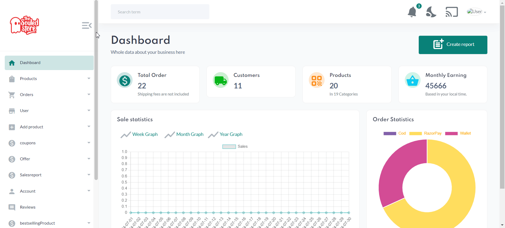
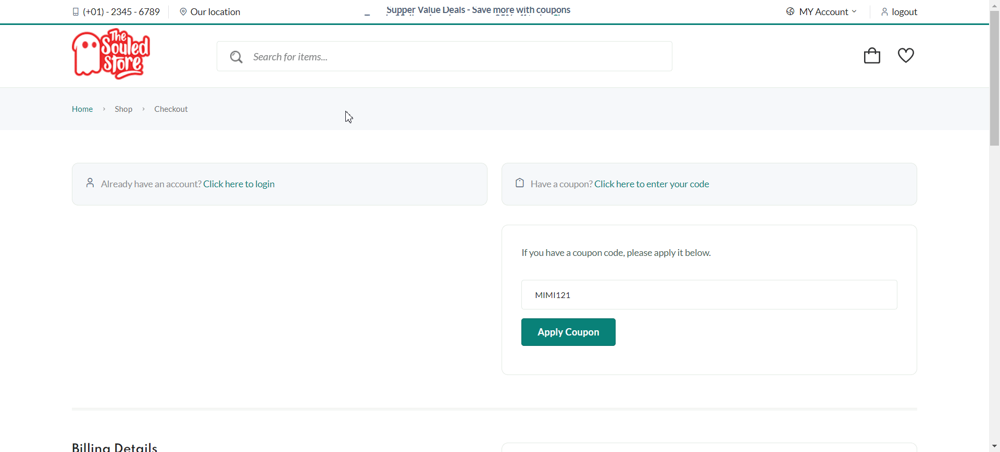
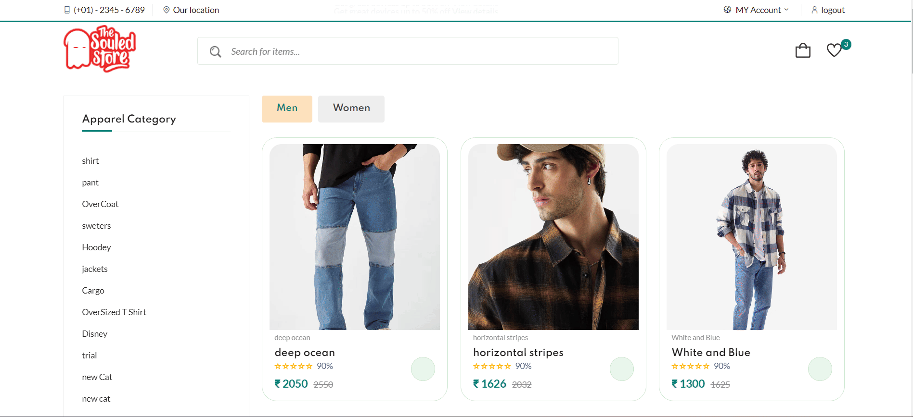

# E-Commerce Website for Apparel Store

## Crafted with Taste and Innovation

Drawing on my background in business and leveraging my own ideas and knowledge, I have developed an e-commerce website for an apparel store with great taste. This project not only meets the technical requirements but also brings a culturally rich and aesthetically pleasing user experience.

### Key Features

#### Admin Side Enhancements
1. **Dashboard**:
   - **Sales and Revenue Charts**: Utilized Chart.js to display sales revenue and categorized data in a clear and visually appealing manner.
   

2. **Product Management**:
   - **Add Product Page**: Admins can add and edit categories directly from the Add Product page, eliminating the need to navigate back to the category page for modifications.
   - **Image Cropping**: Integrated Cropper.js for efficient image cropping, ensuring that product images are presented professionally.

   

3. **Input Validation**:
   - Ensured all input fields are validated to maintain data integrity and enhance user experience.

4. **Coupons Management**:
   - Admins can create, display, and apply coupons on orders. 
   - A unique animation is shown when a coupon is successfully applied, enhancing user engagement and experience.
      

5. **Payment Integration**:
   - Added Razorpay payment gateway for secure and seamless payment processing.
   - Customers can easily complete transactions using a variety of payment methods supported by Razorpay.
    
6. **Search Functionality**:
   - Implemented search functionality that allows users to search for products without reloading the page.
   - Used fetch for retrieving data efficiently, enhancing user experience by providing quick and dynamic search results.
   

7. **Add to Cart**:
   - ***Created a own npm package*** for the add-to-cart functionality.
   - For more information, you can check out my other project on GitHub: [FlytoCart](https://github.com/Karnan-se/flytocart.git)
    - 

### Technical Stack
- **Backend**: Node.js
- **Frontend**: JavaScript
- **Database**: MongoDB
- **Libraries**: Razorpay for payment processing, Cropper.js for image handling, and FlytoCart for cart functionality.
- **Hosting**: AWS
- **Version Control**: GitHub

By combining my business acumen with technical expertise, I have created an e-commerce website that not only meets current market standards but also exceeds client expectations by offering a seamless and automated user experience.
